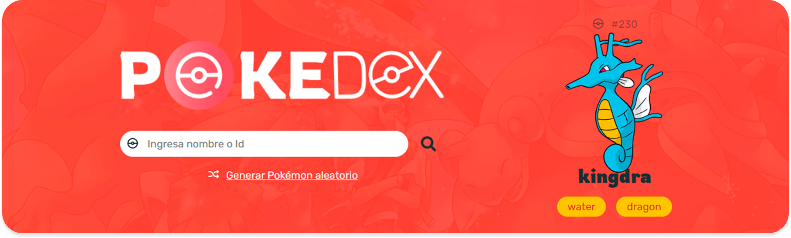

<h1 align="center">POKEDEX UI | Template</h1>

Este boilerplate se pensó para facilitar el seguimiento del proyecto de la [Pokedex UI](https://github.com/richirrim/pokedex-ui-template), pero eres libre de usarlo y modificarlo para cualquier otro proyecto web estático con una estructura sencilla o similar, solo no olvides dar créditos y etiquetar mis redes sociales:

- Instagram | @richirrim: https://www.tiktok.com/@richirrim
- Facebook | @richirrim: https://www.facebook.com/richirrim
- Tiktok | @richirrim: https://www.instagram.com/richirrim/

## 🗃️ CÓMO DESCARGAR EL PRÓYECTO

Hay **tres formas**, la primera es clonando el repositorio a tu máquina local y es la que más vas usar en proyectos reales como web developer.

Antes de hacer un `git clone` te recomiendo que leas las tres formas de descarga una copia del proyecto.

### 1. Clonando el repositorio

Lo primero que debes de hacer es ir al repositorio del proyecto llamado [pokedex-ui-template](https://github.com/richirrim/pokedex-ui-template) y copiar en enlace del proyecto.

Ahora abre un terminal en la ubicación donde guardes todos tus proyectos web y tipea el sig. comando: `git clone https://github.com/richirrim/pokedex-ui-template`.

Y listo tendrás una copia de este proyecto en tu máquina local. Ahora, sin miedo al éxito, puedes empezar a modificarlo a tu gusto.

### 2. Haciendo Fork y clonando el repositorio
Ahora, si eres un developer good, lo ideal seria que hicieras un Fork de este proyecto y luego hicieras un git clone a ese nuevo Fork que encontraras en los repositorios de tu perfil.

### 3. Descargando el proyecto en un archivo ZIP
Ojito, los comando anteriores solo los puedes utilizar  si tienes una cuenta en Github, Git instalado y configurado en tu PC. Ahora, si aún no estás usando Git, es buen momento para decirte que es una herramienta que se va a volver tu pan de cada día como Web Developer. Aparte es una skill muy solicitada por las empresas y que aporta un gran valor a tu perfil profesional. 

Pero para no hacer mucho lío, te puedes descargar el proyecto sin necesidad de tener instalado Git o tener una cuenta en Github.

Solo sigue lo sig. pasos y podrás descargar todo el proyecto en formato ZIP.

## ⛩️ Estructura del proyecto

Sera una estructura muy básica pero organizada.

- **📂 css**: Contiene los estilos del proyecto y el reset para normalizar el css en todos los navegadores y así lograr que nuestro proyecto siempre se vea igual en cualquier navegador.
  - **📄 normalize.css**: Normaliza los estilos en todos los navegadores.
  - **📄 style.css**:  Nuestros estilos.
- **📂 images**: Contiene todas las imágenes del proyecto como logos, banners, etc.
  - **📂 icons**: Aquí encontrarás todos los iconos para este proyecto y también los favicon.  
  - *📂 README*: Esta carpeta ignórala, la uso para guardar imágenes que sirven para documentar el proyecto.
- **📂 js**: Contiene código JavaScript.
  - **📄 script.js**
- **📄 Index.html**
- **📄 README**: Contiene la documentación que estás leyendo.

<h2 align="center">MAY THE DEMO EFFECT BE WITH YOU</h2>

Si encontraste algo útil en este 🚀proyecto y te aporto valor, 🔗compártelo con todo los 👤terricolas del planeta🌎tierra. Y no olvides seguirme en instagram para más contenido good.

